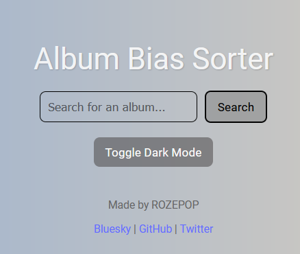
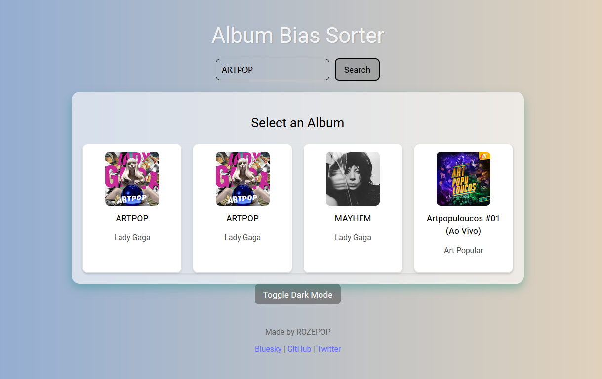
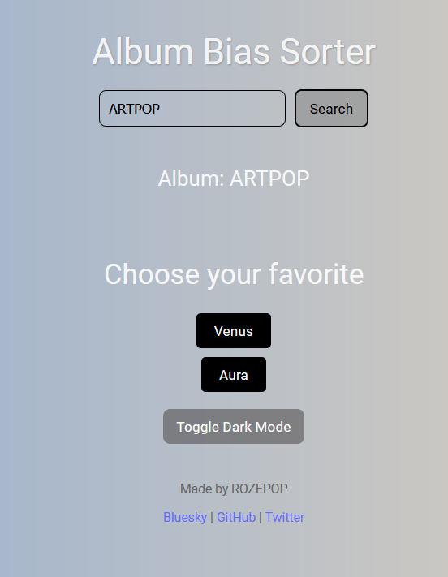
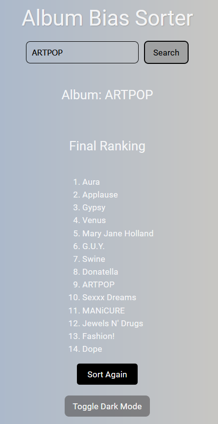

# Album Bias Sorter

A React application that helps you rank songs from your favorite albums by making simple, head-to-head comparisons to determine your personal favorites.

## Features

- **Spotify Integration**: Search for albums directly from Spotify's library
<div style="display: flex; gap: 10px;">


</div> <br><br><br>

- **Simple Interface**: Easy-to-use UI with dark mode support
- **Head-to-Head Comparisons**: Sort songs by choosing your favorite between two options
<div style = "display: flex">
   
</div>

- **Final Rankings**: Get a complete ranked list of all songs from an album
<div>

</div>

- **Responsive Design**: Works on both desktop and mobile devices

## Technologies Used

- **React**: Frontend UI library
- **Vite**: Build tool and development server
- **Spotify API**: Music data source
- **Axios**: HTTP client for API requests

## Installation

### Prerequisites 
- **Node.Js**: Ensure you have Node.js (v16 or higher) installed. [nodejs.org](https://nodejs.org/).
- **Spotify Developer Account**: Create a Spotify Developer account and register an application to get API credentials.

```bash
# Clone the repository
git clone https://github.com/dwainebrannon/album-bias-sorter.git

# Navigate to the project directory
cd album-bias-sorter

# Install dependencies
npm install
```

## Setup

1. You'll need to create a Spotify Developer account and register an application to get API credentials
2. Create a `.env` file in the root directory with the following variables:
   ```
   VITE_SPOTIFY_CLIENT_ID=your_spotify_client_id
   VITE_SPOTIFY_CLIENT_SECRET=your_spotify_client_secret
   ```

## Usage

```bash
# Start the development server
npm run dev
```

Then open your browser and navigate to `http://localhost:5173`

### How to Use

1. **Search for an Album**: Type an album name in the search box
2. **Select an Album**: Choose from the search results
3. **Sort the Songs**: Compare songs head-to-head by clicking on your favorite
4. **View Results**: See the final ranking of all songs

## How It Works

The app uses a sorting algorithm that makes pairwise comparisons to build a sorted list. Each new song is compared against the current sorted list to find its correct position.

## Contributing

Contributions are welcome! Please feel free to submit a Pull Request.

1. Fork the repository
2. Create your feature branch (`git checkout -b feature/amazing-feature`)
3. Commit your changes (`git commit -m 'Add some amazing feature'`)
4. Push to the branch (`git push origin feature/amazing-feature`)
5. Open a Pull Request

## License

This project is licensed under the MIT License - see the [LICENSE](LICENSE) file for details.

## Creator

Made by ROZEPOP

- [Bluesky](https://bsky.app/profile/rozepop.bsky.social)
- [GitHub](https://github.com/dwainebrannon)
- [Twitter](https://twitter.com/rozepop)
