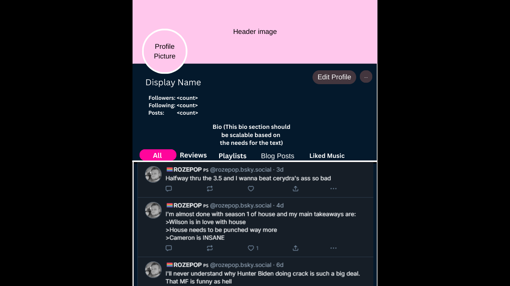
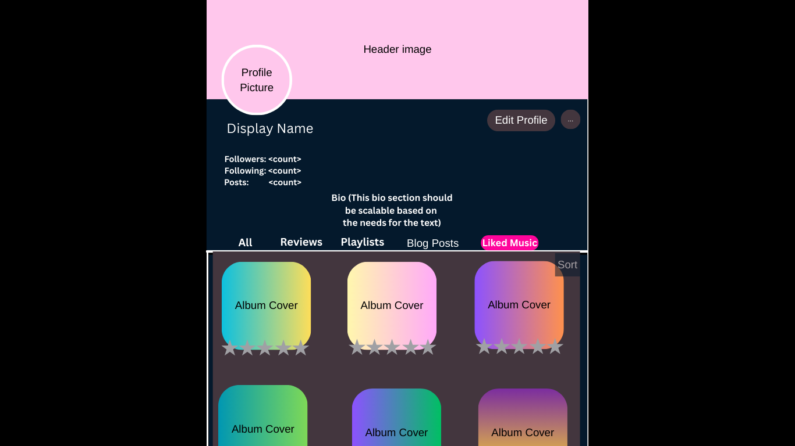
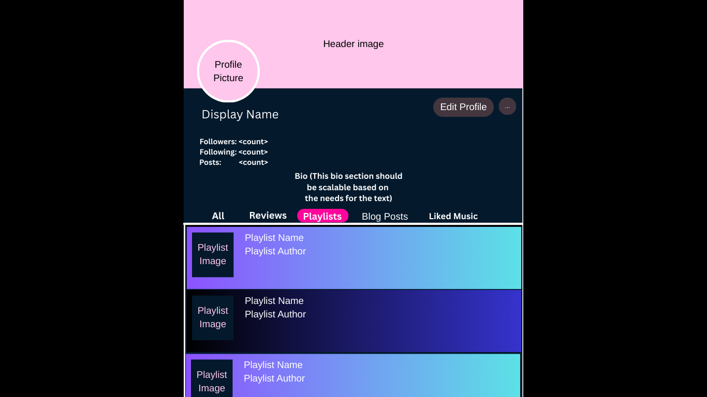
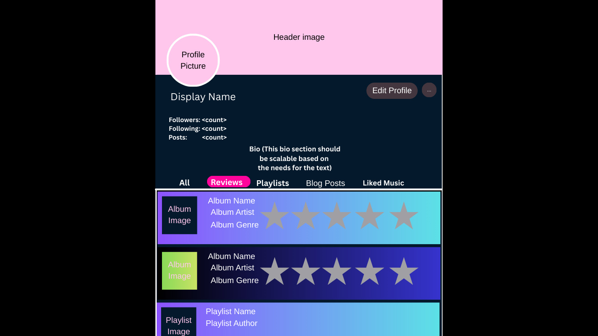
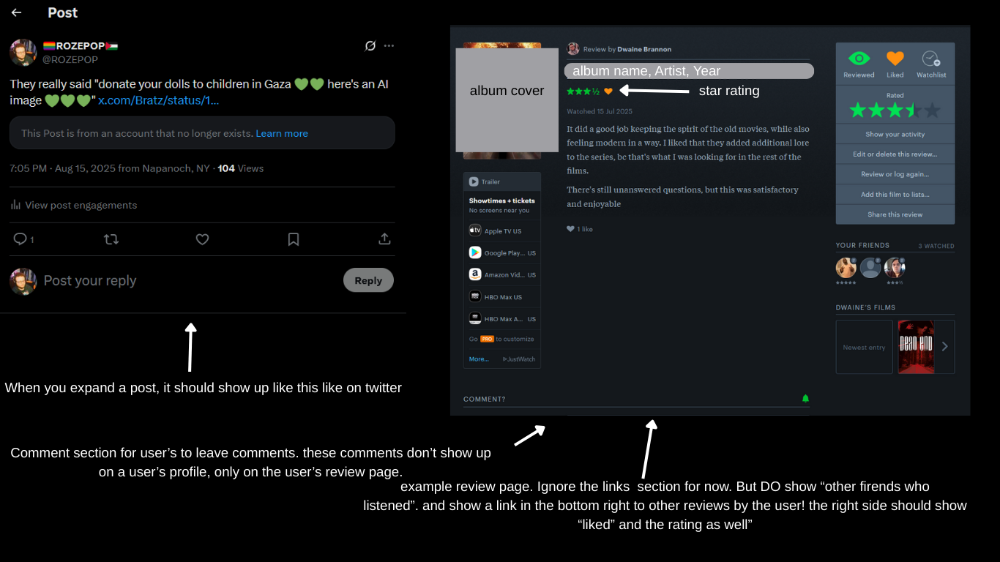

This following image is about what the profile page should look like for the user if they're on their own profile. Profile picture will show the user's profile picture, as stored in firebase. Same with header image, which needs it's own modal as well. The bio field should change size depending on how much text is in the field, so there's no text overlap. The user's timeline should show regular "note" posts, and also "activity" posts like "@rozepop posted a review of "album name' or "@rozepop made a new playlist "playlist name". these should link to the review post page, which will show the full star rating, and a text review if the user put text.

This following image is about what the profile page should look like on the "Liked Music" tab. It's a grid that shows, by default, most recent albums liked/reviewed. Theres a "sort" in the top right which can sort based on "recent" "star rating ascending or descending". The album cover should show the album image from the spotify api of course. and the star rating should only show how many stars the user rated the album, not all 5 stars. When a user clicks on the album, it will go to the "album" page

The following is about what the profile page should look like on the "Playlists" tabs. these show the user's playlists that they've created. The playlist image will by default just be a default image, and the playlist name and author are set by the user. I haven't set up the function for user's to create custom playlists yet!

The following is the "review" tabs on a user's profile. it will show all of the user's recent "review" posts (as opposed to the "all" tab which will show review posts, and notes posts. ). Clicking on a post will bring you to the user's "review" of the album

The following is how a profile should look if it is NOT the logged in user's profile; if they're visiting someone elses profile. Notice it says "follow" instead of "edit profile". If you're following the user, the button should say "following" and pressing it will unfollow them. If you aren't following them, it will say "follow" and clickign it will follow the user.

This is two images showing what a post should look like after clicking. the left one is a normal text post, the right one is when it's a review post

